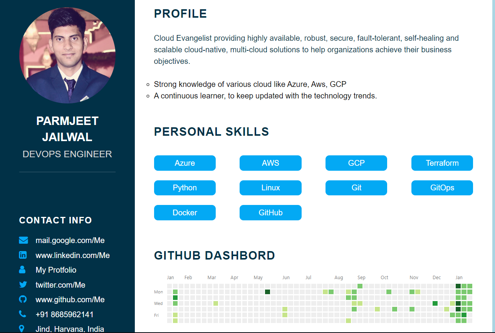

 
    </img>

<h1 align="center"> 🔥Parmjeet Jailwal Resume 🔥 </h1> 
<h3 align="center"> A clean, beautiful, responsive resume ! </h3>

If you like my work, You can follow me on <a href="https://www.linkedin.com/in/parmjeet-jailwal/">LinkedIn</a>,<a href="https://twitter.com/JailwalParmjeet"> Twitter</a>.

# Sections 🌈

✔️ About me\
✔️ Skills \
✔️ Github Dashbord\
✔️ Certifications 🏆\
✔️ Education\
✔️ Contact me

To view a live example, **[click here](https://parmjeetjailwal.github.io/Resume/)**

# Deployment 📦

-   This WebSite is hosted on GitHub Pages
-   I highly recommend using [Github Pages] to achieve this the EASIEST WAY.

# Technologies used 🛠️

-   HTML5
-   CSS3
